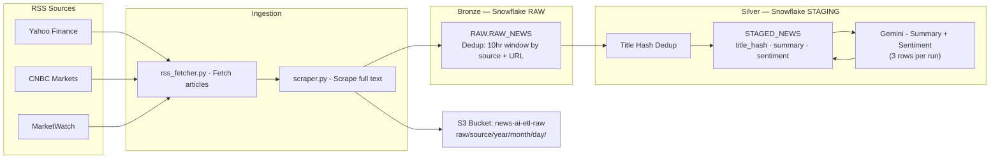

<p align="center">
  
</p>

<p align="center">
  
  
  
  
  
</p>

<h1 align="center">News AI ETL</h1>

<p align="center">
  A scheduled Airflow pipeline that ingests financial news, lands it in S3,
  loads it through a Bronze/Silver Snowflake layer, and enriches it with
  LLM-generated summaries and sentiment.
</p>

<p align="center">
  
  
  
</p>

---

## Overview

This project pulls articles from a set of financial RSS feeds, scrapes the
full article text, archives the raw data to S3, loads it into a Snowflake
**Bronze** layer, deduplicates and enriches it into a **Silver** layer, and
runs each row through Gemini for a generated summary and sentiment label —
all orchestrated as a single Airflow DAG on a 6-hour schedule.

## Architecture



## Pipeline Stages

The DAG (`dags/news_ai_etl_dag.py`) runs six tasks in sequence, on a
6-hour schedule:

| # | Task | Description | Credentials Used |
|---|------|-------------|-------------------|
| 1 | `fetch_rss` | Pull the latest articles from Yahoo Finance, CNBC Markets, and MarketWatch RSS feeds | — |
| 2 | `scrape_articles` | Scrape full article text for each feed entry | — |
| 3 | `save_to_s3` | Archive raw article data to `s3://news-ai-etl-raw/raw/<source>/<year>/<month>/<day>/` | Airflow Connection: `aws_default` |
| 4 | `load_bronze` | Load raw articles into `RAW.RAW_NEWS`, deduplicated on a 10-hour window by source + URL | Airflow Connection: `snowflake_default` |
| 5 | `load_silver` | Deduplicate by title hash and stage clean rows into `STAGED_NEWS` | Airflow Connection: `snowflake_default` |
| 6 | `enrich_with_llm` | Generate a summary and sentiment label per row via Gemini (3 rows per run) | Airflow Variable: `gemini_api_key` |

## Tech Stack

- **Orchestration:** Apache Airflow
- **Storage:** AWS S3 (raw landing zone)
- **Warehouse:** Snowflake (Bronze/Silver layers)
- **Enrichment:** Google Gemini (summarization + sentiment)
- **Language:** Python

## Project Structure

```
news-ai-etl/
├── ingestion/
│   ├── config.py             # RSS feed URLs
│   ├── rss_fetcher.py        # Fetch and parse RSS feeds
│   └── scraper.py            # Scrape full article text from URLs
├── storage/
│   ├── s3_storage.py         # Save raw JSON to S3 (date-partitioned)
│   ├── snowflake_loader.py   # Load raw articles into Snowflake bronze
│   ├── silver_loader.py      # Dedup by title hash, load into silver
│   └── llm_enricher.py       # Gemini summary + sentiment, written back to silver
├── snowflake_queries/
│   ├── setup.sql              # Bronze layer DDL (RAW schema + RAW_NEWS table)
│   └── staging_setup.sql      # Silver layer DDL (STAGING schema + STAGED_NEWS table + LLM columns)
├── dags/
│   └── news_ai_etl_dag.py    # Same 6 steps as run.py, split into Airflow tasks
├── docs/
│   └── architecture.md       # Full architecture diagram
├── run.py                     # Main pipeline entry point (local/manual run, uses .env)
├── requirements.txt
├── requirements-airflow.txt   # Extra provider packages needed only by the DAG
└── .env                        # Local credentials (never committed)
```

### Two ways to run this pipeline

- **`run.py`** — a standalone local/manual run of the same six steps, reading credentials from `.env`. Useful for development and one-off runs without standing up Airflow.
- **`dags/news_ai_etl_dag.py`** — the same pipeline logic orchestrated as an Airflow DAG on a 6-hour schedule, reading credentials from Airflow Connections/Variables instead of `.env` (see below).

## Airflow Setup

This project reads credentials from **Airflow Connections and Variables**,
not a `.env` file. Configure the following in the Airflow UI
(**Admin → Connections** / **Admin → Variables**) before running the DAG:

| Type | Name | Used By |
|------|------|---------|
| Connection | `aws_default` | `save_to_s3` |
| Connection | `snowflake_default` | `load_bronze`, `load_silver` |
| Variable | `gemini_api_key` | `enrich_with_llm` |

## Getting Started

### Option A — Local / manual run (`run.py`)

1. **Clone the repository** and navigate into the project folder.
2. **Install dependencies:** `pip install -r requirements.txt`
3. **Create a `.env` file** with your AWS, Snowflake, and Gemini credentials.
4. **Run the pipeline SQL setup** — `snowflake_queries/setup.sql` then `snowflake_queries/staging_setup.sql` in a Snowflake worksheet, to create the Bronze and Silver schemas/tables.
5. **Run it:** `python run.py`

### Option B — Airflow (`dags/news_ai_etl_dag.py`)

1. **Clone the repository** and navigate into the project folder.
2. **Install Airflow dependencies:** `pip install -r requirements-airflow.txt` (in addition to `requirements.txt`).
3. **Run the Snowflake SQL setup** as in Option A, if not already done.
4. **Set up Airflow** (Docker Compose recommended).
5. **Configure credentials** as Airflow Connections/Variables per the table above — never hardcode them in the DAG.
6. **Start Airflow** and open the UI.
7. **Add the Connections and Variable** listed above under **Admin**.
8. **Trigger `news_ai_etl_dag`**, or let it run on its 6-hour schedule.
9. **Verify data** in `RAW.RAW_NEWS` (Bronze) and `STAGED_NEWS` (Silver) in Snowflake.

## Schedule

Runs automatically every 6 hours, pulling new articles, archiving raw
copies to S3, and progressively enriching them through the Bronze → Silver
→ LLM-enrichment stages.

---

<p align="center">
  <sub>Built with Apache Airflow · AWS S3 · Snowflake · Gemini</sub>
</p>
